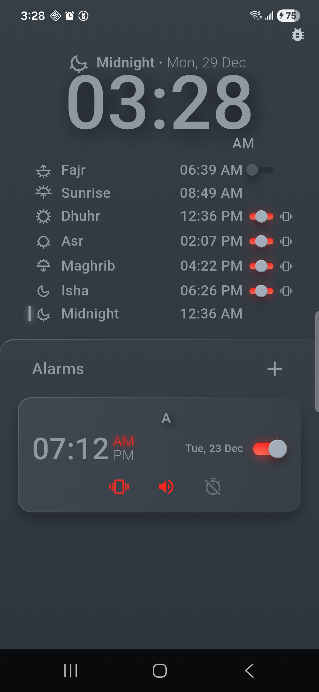
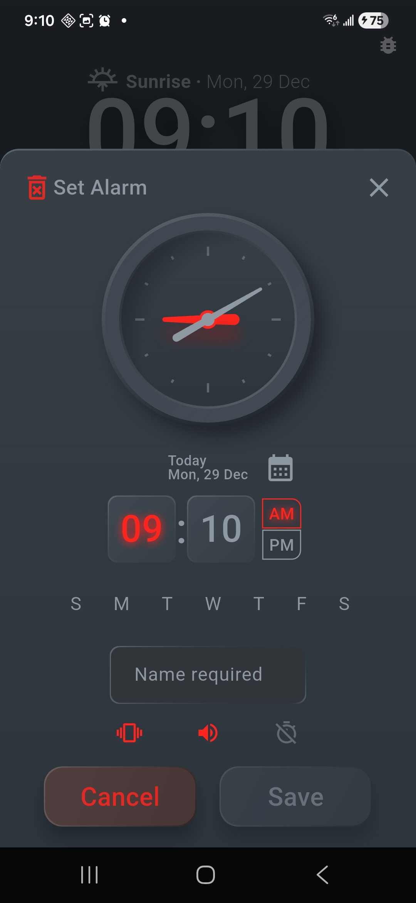

# prayer_alarm
An Application for creating alarms and tracking prayer times (with notifications)

<div style="display: flex; gap: 8px;">
   
   
</div>

### Prerequisites
1. Dart/Flutter installed on your device
2. Android device or emulator

### Installation
1. Clone this repo
2. Get deps - `flutter pub get`
3. Run code generation
   - `dart run build_runner build` - freezed and jsonserializable
4. Finally run with - `flutter run`

```bash
flutter pub get
dart run build_runner build
flutter run
```
 
### To regenerate the jni bindings
- first make the required changes in the Java/Kt layer
- then build an apk `flutter build apk` followed by `dart ./tool/jnigen.dart`
- finally, if required, update the Dart layer to reflect the changes  

```bash
flutter build apk
dart ./tool/jnigen.dart
```